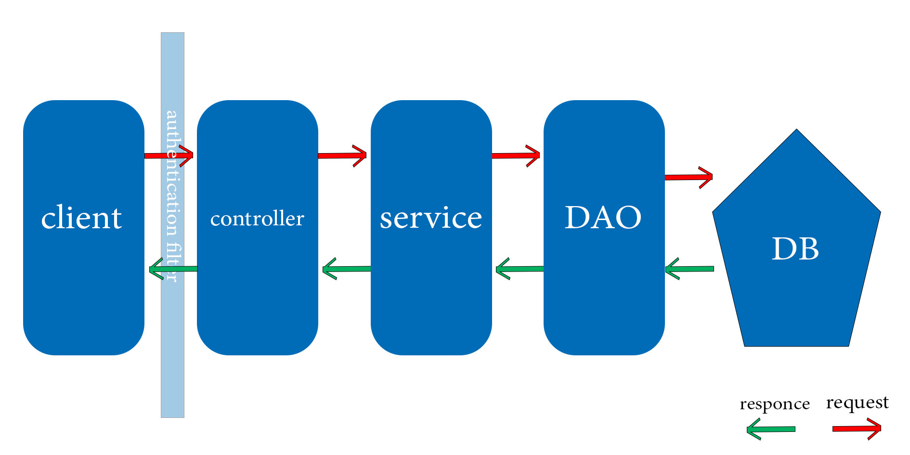

# taxi-service

___

**summary:**
* Java 11 web-Application for managing cars, drivers and manufacturers.
* 3-tier architecture used.
* Application supports CRUD, REST design patterns, DAO, Service and Controller layers as well.

***

**What can taxi-service do?**
* Authenticate and authorise drivers;
* register new drivers;
* add, display, delete drivers and cars related to them
* add, display, delete cars and drivers related to them
* add, display, delete manufacturers

***

**Project structure:**

***

**Technologies**

* Java 11
* Maven
* JUnit
* JDBC
* MySQL
* Servlet
* JSTL
* JSP
* Tomcat
* AWS
* log4j

***

**How to run project**

Requirements

* Java 11 
* Tomcat 9.0.50
* MySQL 8.0.30

To compile and launch the application please set up database structure. You can execute SQL script
src/main/resources/init_db.sql in any admin panel of your MySQL.

Then setup connection attributes to your database into ConnectionUtil class.

Configure Tomcat server: add artifact for deploying.

Run Tomcat configuration.

To test the application please follow this [link](http://app-env-103.eba-2xqngczb.eu-north-1.elasticbeanstalk.com/login)